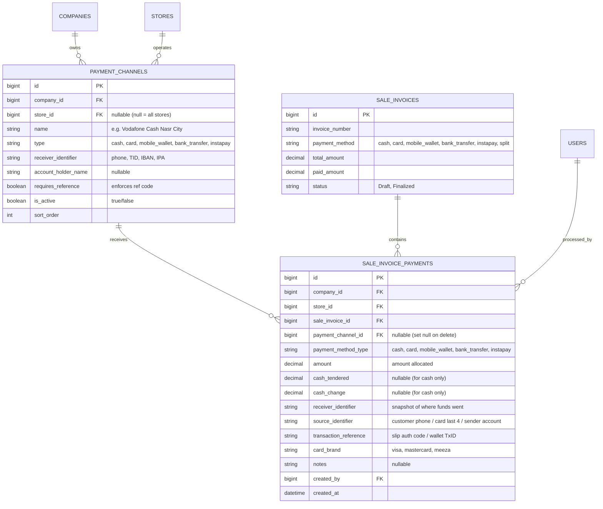
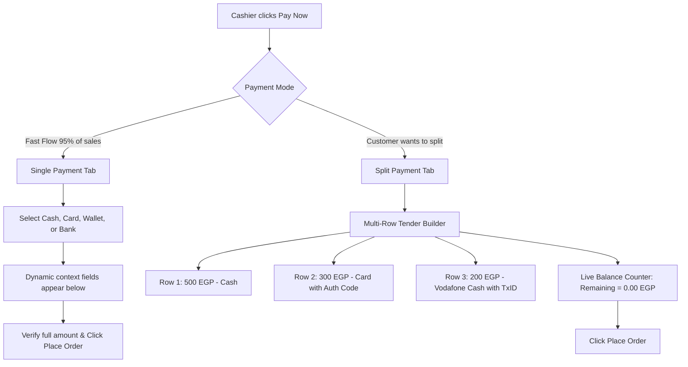
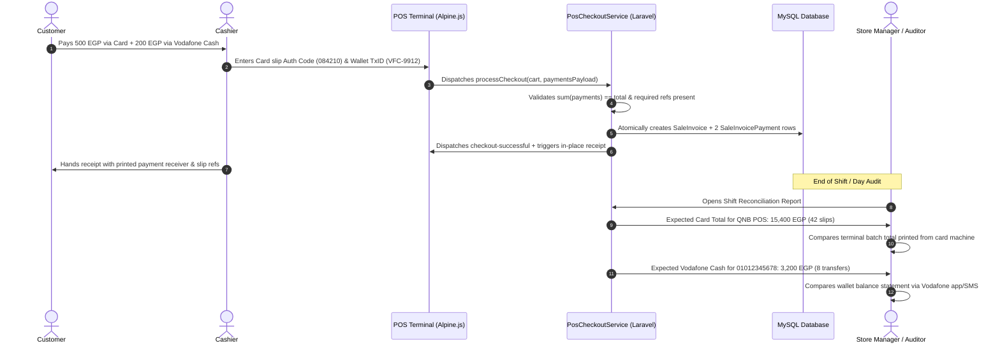

# Architecture & Implementation Plan: Advanced Payment Methods, Split Payments & Anti-Fraud Tracking

---

## 1. Executive Summary & Vision

In high-volume retail and POS operations, payment handling goes far beyond simple cash exchange. Modern Egyptian and regional retail environments operate across diverse payment ecosystems:
1. **Physical Cash** (Cash drawers with tendered amounts and change calculation).
2. **Card POS Terminals** (Bank terminals from CIB, NBE, QNB, Banque Misr, Paymob, Geidea, Fawry, Aman).
3. **Mobile Wallets** (Vodafone Cash, Orange Cash, Etisalat Cash, WE Pay).
4. **Instant Payment Networks & Direct Transfers** (InstaPay IPN, Bank Wire Transfers).
5. **Split / Multi-Tender Payments** (Splitting a single bill across multiple methods, e.g., 500 Cash + 300 Card + 200 Vodafone Cash).

### The Core Problem: Auditing, Fraud Prevention & Trust
Without strict payment tracking, businesses suffer from two major vulnerabilities:
- **Cashier Manipulation & Theft**: A dishonest cashier can accept cash from a customer, pocket the bills, and mark the invoice as "Card" or "Vodafone Cash" in the system. Without requiring verified transaction references and receiver account identifiers, this discrepancy is difficult to identify until monthly bank statements arrive.
- **Settlement & Reconciliation Friction**: At shift closing, store managers and accountants struggle to reconcile the cash drawer and bank slips unless every transaction is tagged with the exact receiving terminal/SIM and slip auth code.

This plan details the design of an end-to-end payment management system that gives store managers and company admins full control, auditability, and fraud protection, while keeping the cashier checkout flow lightning-fast.

---

## 2. Industry Standards Analysis (Benchmark: Square, Shopify, Odoo, Toast)

| POS System | Architecture Approach | Split Payment Support | Reference / Audit Tracking | Channel / Account Mapping |
| :--- | :--- | :--- | :--- | :--- |
| **Odoo POS** | Dedicated `pos.payment.method` linked to accounting journals; orders have multiple `pos.payment` records. | Native multi-tender lines with remaining balance calculator. | Custom transaction reference per payment record; slip slip printing. | Store-level and company-level financial journals. |
| **Shopify POS** | Parent `Order` with child `transactions` (tenders) array (`kind: sale, refund`). | Yes, unlimited tenders per order. | Stores Gateway, Payment Details (`last4`, `card_brand`), and receipt payload. | Gateways mapped to store location and payment processors. |
| **Square POS** | `Order` with `tenders` array (`type: CASH, CARD, OTHER`). | Yes, splits across cash, cards, gift cards. | Auth codes, card brand, entry method, and custom tender notes. | Location-scoped register accounts. |
| **Toast POS** | Check-level and seat-level multi-tender split payments. | High flexibility (split by amount or by item). | Terminal ID, approval code, masked card number. | Terminal-to-merchant ID mapping. |

### Key Takeaways for `markt_pos`:
1. **Never store payment only as a single enum column on the invoice**. An invoice must have a `hasMany` relationship to individual payment records (`SaleInvoicePayment`), while retaining a summary `payment_method` column (`cash`, `card`, `mobile_wallet`, `bank_transfer`, `instapay`, or `split`) for fast indexing and reporting.
2. **Separation of "Payment Channel" (Receiver) vs "Payment Transaction" (Tender)**:
   - A **Payment Channel** is a configured asset owned by the business (e.g. *Vodafone Cash SIM #1*, *QNB POS Terminal #2*, *CIB Bank Account*).
   - A **Payment Transaction** is the actual record of money transferred for an invoice (e.g. *250 EGP deposited into QNB POS Terminal #2 from Visa \*\*\*\* 4821 with Auth Code 982141*).
3. **Auditing Immortality (Snapshot Principle)**: If a store manager renames or deactivates a payment channel tomorrow, historical invoices must still preserve the exact receiver identifier and reference numbers recorded at the time of sale.

---

## 3. Core Terminology & Data Schema Architecture

### A. The Three Identifiers
To satisfy the user's requirements and establish full audit integrity:
1. **Receiver Identifier** (Where did the money land?):
   - Configured on the store's Payment Channel.
   - Examples:
     - For Bank Transfer: Bank Name & IBAN/Account Number (`EG58000...4821`).
     - For Mobile Wallet: Store Wallet Phone Number (`01012345678`).
     - For Card: POS Terminal ID (TID) or Merchant ID (MID) (`TID-908124`).
     - For InstaPay: Store IPA Handle (`store1@instapay`).
     - For Cash: Cash Register / Drawer identifier (`Drawer-1`).
2. **Source Identifier** (Who sent the money?):
   - Captured by the cashier during checkout.
   - Examples:
     - For Card: Last 4 digits of customer's card (`5521`) and Card Brand (`Visa`, `Mastercard`, `Meeza`).
     - For Mobile Wallet: Customer's sender phone number (`01099887766`).
     - For Bank / InstaPay: Customer's bank name, sender account, or customer InstaPay username.
3. **Transaction Reference** (What is the proof of transfer?):
   - The unique proof code generated by the financial network or hardware.
   - Examples:
     - For Card: Authorization Code / RRN (Retrieval Reference Number) printed on the POS terminal slip (e.g. `AUTH: 094821`).
     - For Mobile Wallet: Transaction ID from incoming SMS (e.g. `VFC-8921048`).
     - For Bank / InstaPay: Bank Transfer Reference / InstaPay Transaction Ref (e.g. `IPN-20260923-4921`).

---

### B. Proposed Database Schema



#### Detailed Table Specifications:

#### 1. `payment_channels` Table
```sql
CREATE TABLE payment_channels (
    id BIGINT UNSIGNED AUTO_INCREMENT PRIMARY KEY,
    company_id BIGINT UNSIGNED NOT NULL,
    store_id BIGINT UNSIGNED NULL, -- NULL indicates available across all company stores
    name VARCHAR(255) NOT NULL, -- e.g. "QNB POS Machine 1", "Vodafone Cash - Store SIM"
    type VARCHAR(50) NOT NULL, -- 'cash', 'card', 'mobile_wallet', 'bank_transfer', 'instapay', 'other'
    receiver_identifier VARCHAR(255) NOT NULL, -- The destination ID (Phone number, TID, IBAN, InstaPay handle)
    account_holder_name VARCHAR(255) NULL,
    requires_reference BOOLEAN NOT NULL DEFAULT TRUE, -- Cash defaults to false, non-cash to true
    is_active BOOLEAN NOT NULL DEFAULT TRUE,
    sort_order INT NOT NULL DEFAULT 0,
    created_at TIMESTAMP NULL,
    updated_at TIMESTAMP NULL,
    FOREIGN KEY (company_id) REFERENCES companies(id) ON DELETE CASCADE,
    FOREIGN KEY (store_id) REFERENCES stores(id) ON DELETE CASCADE,
    INDEX idx_company_store_active (company_id, store_id, is_active)
);
```

#### 2. `sale_invoice_payments` Table
```sql
CREATE TABLE sale_invoice_payments (
    id BIGINT UNSIGNED AUTO_INCREMENT PRIMARY KEY,
    company_id BIGINT UNSIGNED NOT NULL,
    store_id BIGINT UNSIGNED NOT NULL,
    sale_invoice_id BIGINT UNSIGNED NOT NULL,
    payment_channel_id BIGINT UNSIGNED NULL,
    payment_method_type VARCHAR(50) NOT NULL, -- Snapshot of channel type
    amount DECIMAL(15,2) NOT NULL, -- Portion paid by this tender
    cash_tendered DECIMAL(15,2) NULL, -- Specifically for cash calculation
    cash_change DECIMAL(15,2) NULL, -- Specifically for cash calculation
    receiver_identifier VARCHAR(255) NOT NULL, -- Immutable snapshot of receiving ID
    source_identifier VARCHAR(255) NULL, -- Customer identifier (Phone / Card last 4 / sender bank)
    transaction_reference VARCHAR(255) NULL, -- Slip auth code, TxID, receipt number
    card_brand VARCHAR(50) NULL, -- 'visa', 'mastercard', 'meeza'
    notes TEXT NULL,
    created_by BIGINT UNSIGNED NOT NULL,
    created_at TIMESTAMP NULL,
    updated_at TIMESTAMP NULL,
    FOREIGN KEY (company_id) REFERENCES companies(id) ON DELETE RESTRICT,
    FOREIGN KEY (store_id) REFERENCES stores(id) ON DELETE RESTRICT,
    FOREIGN KEY (sale_invoice_id) REFERENCES sale_invoices(id) ON DELETE CASCADE,
    FOREIGN KEY (payment_channel_id) REFERENCES payment_channels(id) ON DELETE SET NULL,
    FOREIGN KEY (created_by) REFERENCES users(id) ON DELETE RESTRICT,
    INDEX idx_invoice_payments (sale_invoice_id),
    INDEX idx_channel_date (payment_channel_id, created_at),
    INDEX idx_tx_ref (transaction_reference)
);
```

---

## 4. Payment Methods & Requirements Matrix

| Method | Type Key | Receiver Identifier (System Owned) | Source Identifier (Customer Provided) | Transaction Reference (Proof of Payment) | Required Fields |
| :--- | :--- | :--- | :--- | :--- | :--- |
| **Cash** | `cash` | Cash Drawer / Register ID (default: `"Store Cash Drawer"`) | *None* | *None* (optional receipt note) | `amount`, `cash_tendered`, `cash_change` |
| **Card (POS Terminal)** | `card` | Terminal ID (TID) / Machine Name (e.g. `"QNB POS-01"`) | Card Brand (`Visa`, `Mastercard`, `Meeza`) + Last 4 digits (`4821`) | Approval / Auth Code from bank thermal slip (`094182`) | `channel_id`, `amount`, `transaction_reference`, `card_brand` |
| **Mobile Wallet** | `mobile_wallet` | Store Wallet Mobile Number (e.g. `"01012345678"`) | Customer Wallet Mobile Number (e.g. `"01099887766"`) | Wallet Transaction ID from SMS (e.g. `"VFC-892104"`) | `channel_id`, `amount`, `source_identifier` (customer phone), `transaction_reference` |
| **InstaPay** | `instapay` | Store InstaPay GPA / Handle (e.g. `"mool@instapay"`) | Customer IPA or Sender Mobile / Bank | IPN Reference Number (`"IPN-9021482"`) | `channel_id`, `amount`, `transaction_reference` |
| **Bank Transfer** | `bank_transfer`| Store Bank Account / IBAN (`"CIB EG92000...48"`) | Customer Bank Name / Account Name | Bank Deposit Slip / Transfer Reference | `channel_id`, `amount`, `transaction_reference` |

---

## 5. User Interface & Checkout Modal Design

We adapt the mockup provided in `img_1.png` and harmonize it with our sleek, glassmorphic POS design system.

### A. Two Operational Modes in POS Checkout Modal:



### B. Split Payment Interaction (Inspired by `img_1.png`):
1. **Dynamic Tender Rows**:
   - Each row contains:
     - **Method Selector** (Select from active Store Payment Channels: Cash Drawer, QNB POS, Vodafone Cash, etc.).
     - **Paying Amount** (Numeric input, auto-populates remaining balance when adding a new row).
     - **Contextual Reference Trigger / Popover**:
       - For Card: input for `Auth Code` and `Card Last 4`.
       - For Wallet: input for `Sender Phone` and `TxID`.
     - **Row Delete Button** (`[X]`, enabled when more than 1 tender row exists).
2. **"+ Add Payment Method" Button**:
   - Appends a new tender row.
   - Automatically initializes the new row's amount with `cartTotal - totalAllocatedSoFar`.
3. **Real-Time Settlement Sidebar (Right Side or Prominent Banner)**:
   - **Total Payable**: e.g. `1,000.00 EGP`
   - **Total Paying**: e.g. `1,000.00 EGP`
   - **Remaining Due**: e.g. `0.00 EGP` (If `> 0`, highlighted in red; blocks checkout).
   - **Change Due**: e.g. `0.00 EGP` (If Cash is tendered higher than allocated amount).
4. **Strict Safety Guards**:
   - Underpayment is blocked (`totalAllocated < cartTotal`).
   - Overpayment on non-cash methods is blocked (you cannot pay 600 Card on a 500 bill; overpayment is only permitted on Cash as tendered money resulting in change).
   - Required transaction references must be non-empty before submission.

---

## 6. Anti-Fraud, Auditing & Reconciliation Workflow



### Benefits for Business Owners:
1. **Zero Phantom Payments**: A cashier cannot close a sale without providing the transaction proof.
2. **Instant Batch Reconciliation**: At closing, the cashier simply matches the machine batch total printed from the bank POS device with the system report. If they don't match, the auditor can look up individual invoices by `transaction_reference`.
3. **Dispute Resolution**: If a customer claims a refund or a bank initiates a chargeback inquiry, the merchant can immediately locate the exact invoice and terminal approval code in seconds.

---

## 7. Returns & Refunds Integration

When a customer returns items via **Sale Returns**:
1. **Policy Enforcement**:
   - The return should default to refunding through the **original payment channel**.
   - If an invoice was paid via Vodafone Cash to `01012345678`, the refund record tracks that money was refunded from that channel (or cash if store policy permits override by manager).
2. **Refund Tracking**:
   - A return invoice will record a matching `SaleReturnPayment` (or negative payment movement) capturing the destination of the refunded funds and the refund reference.

---

## 8. Receipt & Invoice Thermal Print Layout

The 80mm thermal receipt (`print.thermal.invoice`) will be enhanced to display the breakdown:

```text
==================================================
                 MOOL MARKET - NASR CITY
               Branch: Nasr City Main Store
==================================================
Invoice #: INV-2026-004812        Date: 2026-09-23 15:42
Cashier: Ahmed Kalash            Customer: Walk-in
--------------------------------------------------
Items Total (3 items):                  1,250.00 EGP
Tax (Included 14%):                       153.51 EGP
--------------------------------------------------
GRAND TOTAL:                            1,250.00 EGP
==================================================
PAYMENT DETAILS / طرق الدفع:
--------------------------------------------------
* VISA / MASTERCARD:                      800.00 EGP
  Terminal: QNB POS-01 (TID: 894102)
  Auth Code: 094821 | Card: **** 4821

* VODAFONE CASH:                          250.00 EGP
  To Wallet: 01012345678
  From: 01099887766 | Ref: VFC-902148

* CASH:                                   200.00 EGP
  Tendered: 200.00 EGP | Change: 0.00 EGP
==================================================
           Thank you for shopping with us!
```

---

## 9. Filament Back-Office Administration

We will create a clean Filament Resource: `PaymentChannelResource` (under Settings or Finance navigation group):
- **List / Table**:
  - Name, Channel Type badge, Receiver Identifier, Assigned Store (or Global badge), Active toggle, Reference Required toggle.
- **Form**:
  - Name (e.g. `CIB POS Terminal #1`, `Vodafone Cash Nasr City`).
  - Channel Type (`Select` using `PaymentChannelType` enum).
  - Receiver Identifier (`TextInput` with clear helper text: e.g. "Enter the phone number, Terminal ID, or IBAN").
  - Requires Reference (`Toggle`: enforce auth code / TxID at checkout).
  - Store scope (`Select` with company vs store level rules as defined in project conventions).

---

## 10. Phased Implementation Roadmap

### Phase 1: Database & Backend Architecture
1. Create `PaymentChannelType` enum (`cash`, `card`, `mobile_wallet`, `bank_transfer`, `instapay`, `other`).
2. Migration: Create `payment_channels` table and `sale_invoice_payments` table.
3. Models: `PaymentChannel` and `SaleInvoicePayment` with relationships, store/company scopes, and audit tracking.
4. DTOs: Update `CheckoutMetaDataDTO` and create `PaymentItemDTO`.
5. Update `PosCheckoutService::checkout()` and `SaleInvoiceService` to persist multi-tender payment lines within atomic transactions.
6. Create `PaymentChannelSeeder` for default cash drawers and demo channels.

### Phase 2: Back-Office Management (Filament Resource)
1. Build `PaymentChannelResource` (List, Create, Edit) following all Filament guidelines (helper texts, tooltips, store visibility rules).
2. Translation files (`lang/en/payment_channel.php` and `lang/ar/payment_channel.php`).

### Phase 3: POS Terminal Frontend (Alpine.js & Blade)
1. Expose active payment channels from Livewire to Alpine (`paymentChannelList`).
2. Upgrade Checkout Modal:
   - Provide "Fast Single Payment" mode and "Split Payment" mode.
   - Dynamic contextual inputs (TID, Auth Code, Sender Phone, TxID).
   - Real-time balance allocation calculator (`img_1.png` parity).
3. Update thermal print view (`invoice.blade.php`) to display detailed payment breakdowns.

### Phase 4: Automated Testing & Verification
1. Feature tests in `tests/Feature/PaymentChannelTest.php` and `PosTerminalTest.php`:
   - Single payment with reference.
   - Split payment (Cash + Card + Wallet) verifying exact total allocation.
   - Validation failures (underpayment, missing reference code, overpayment on non-cash).
2. End-to-end browser subagent verification with video recording.

---

## 11. Open Questions & Design Decisions for User

> [!IMPORTANT]
> **Questions for Alignment:**
> 1. **Default Channels per Store**: When a new store is created, should the system automatically seed a default `"Store Cash Drawer"` channel?
> 2. **Reference Enforcement for Card/Wallet**: Should the `Transaction Reference` (Auth code / TxID) be **strictly mandatory** for all Card and Mobile Wallet transactions, or should managers be able to toggle it per channel? (We recommend making it toggleable, defaulting to required for maximum fraud protection).
> 3. **Card Number Privacy**: When capturing Card information, we recommend **only storing the last 4 digits** (never the full 16-digit PAN or CVV) to strictly comply with PCI-DSS data security standards. Do you agree?
> 4. **Scope of First Milestone**: Would you like to review and approve this architecture before we initiate Phase 1?
