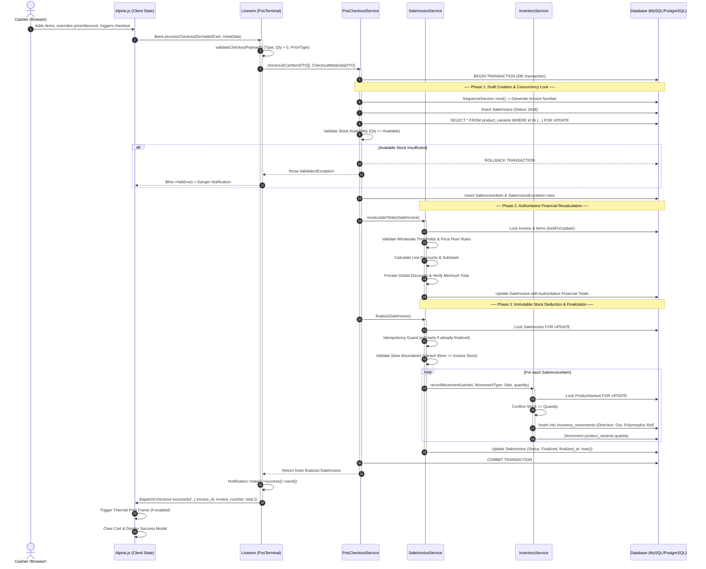

# 🛒 Markt POS & Enterprise Retail ERP

[](https://laravel.com)
[](https://filamentphp.com)
[](https://livewire.laravel.com)
[](https://alpinejs.dev)
[](https://tailwindcss.com)
[](https://php.net)
[](https://phpunit.de)

> **A mission-critical, concurrent, multi-store Point of Sale and ERP system designed for enterprise data integrity, high-throughput checkout, and mathematical financial accuracy.**

---

## 📌 Executive Overview

In enterprise retail, **a race condition is not a software glitch—it is real money lost**. Multiple cashiers simultaneously ringing up the last unit of stock, floating-point rounding errors drifting monthly ledgers, and slow DOM diffing freezing barcode scanners are common pitfalls in retail software.

**Markt POS** was engineered from the ground up to solve these core operational challenges. Built on **Laravel 12**, **Filament v4**, **Livewire 3**, and **Alpine.js**, it bridges high-performance reactive frontends with hardened database transactions, pessimistic locking, immutable stock ledgers, and a strict multi-tenant boundary.

---

## 🏗️ Architecture & Concurrency Pipeline

The Point of Sale checkout flow is fully atomic. Below is the precise, production-verified sequence of how a transaction is processed, locked, validated, and finalized without race conditions:



---

## 💡 Core Engineering Case Studies

### 1. Concurrency Control & Race Condition Elimination
* **The Business Risk:** In high-volume stores with multiple POS registers, two cashiers scanning the last remaining unit of an item simultaneously will cause a negative inventory balance if relying on optimistic checks.
* **Our Solution:**
  * Implemented pessimistic locking (`SELECT ... FOR UPDATE`) inside atomic database transactions (`DB::transaction`) during draft assembly in `PosCheckoutService` and stock deduction in `InventoryService`.
  * **Idempotency by Design:** Under network latency, a cashier might double-click the checkout button. The `SaleInvoiceService::finalize()` method re-checks document status under row lock:
    ```php
    // Prevents double-deduction under rapid multi-click
    $invoice = SaleInvoice::query()->where('id', $invoice->id)->lockForUpdate()->firstOrFail();
    if ($invoice->isFinalized()) {
        return;
    }
    ```
  * If validation fails at any point (stock deficit, price below floor), the entire transaction rolls back cleanly, leaving zero orphan records.

---

### 2. Eliminating Livewire DOM Thrashing: The Custom RPC Architecture
* **The Technical Challenge:** Binding cashier shopping cart inputs (quantity steppers, price overrides, discount typing) using standard Livewire `wire:model` triggers server round-trips on every keystroke. Under rapid cashier input, network latency causes **DOM morphing race conditions**, overwriting active inputs and creating noticeable UI lag.
* **The Architecture:**
  * **Client (Alpine.js) Owns:** High-frequency interactive state (the shopping cart, line-item quantities, price toggles, discount modes, cash denomination math). Cashiers enjoy **0ms instantaneous UI response**.
  * **Server (Livewire) Owns:** Master reference data (`storeList`, `customerList`, `categoryList`), server-side catalog pagination, and database transactions.
  * **Standardized RPC Bridge:** For asynchronous actions (e.g., creating a customer or shipping destination on-the-fly), the app uses a standardized `RpcResponse` schema:
    ```php
    return RpcResponse::success(data: $result);
    // or
    return RpcResponse::fromValidator($validator);
    ```
  * The frontend `RpcHandler` routes validation errors directly to specific field borders in Alpine without triggering full-component re-renders.

---

### 3. Double-Entry Immutable Inventory Ledger
* **The Naive Approach:** Directly updating `product_variants.quantity = quantity - 5`. This destroys auditability, makes reconciliation impossible, and hides employee theft or inventory shrinkage.
* **Our Solution:**
  * Direct modification of `product_variants.quantity` is strictly prohibited. Every stock mutation MUST flow through `InventoryService::recordMovement()`.
  * Every mutation writes an immutable row to `inventory_movements` capturing:
    * `variant_id` & `store_id`
    * `type` (`Sale`, `SaleReturn`, `Purchase`, `AdjustmentAdd`, `AdjustmentSub`, etc.)
    * `direction` (`In` or `Out`)
    * `quantity`
    * `reference_type` & `reference_id` (Polymorphic link to `SaleInvoice`, `PurchaseInvoice`, etc.)
    * `user_id` (Audit trail of who performed the action)
  * The `product_variants.quantity` column acts purely as an atomically updated cache (`increment` / `decrement`) synchronized inside the same database transaction.

---

### 4. Mathematical Precision & Weighted Prorated Refund Engine
* **The Accounting Problem:** If a customer purchases three items totaling \$100 and receives a \$10 global invoice discount, what is the exact refund amount if they return just *one* item? Naively refunding the item's sticker price causes financial loss; dividing the discount equally is unfair to items of unequal value.
* **Our Implementation:**
  * In `SaleInvoiceService::calculateRefundBreakdown()`, the system calculates the **weighted ratio** of the returned item relative to the total discounted invoice value down to 4 decimal places:
    $$\text{Item Weight} = \frac{\text{Line Subtotal after Line Discount}}{\text{Total Invoice Subtotals after Line Discounts}}$$
    $$\text{Prorated Global Discount} = \text{Item Weight} \times \text{Global Invoice Discount}$$
    $$\text{Effective Unit Refund} = \frac{\text{Line Subtotal} - \text{Prorated Global Discount}}{\text{Quantity}}$$
  * Strict rounding (`round($amount, 2)`) is applied before persistence to eliminate **IEEE 754 floating-point drift** across aggregated monthly financial reports.

---

### 5. Multi-Tenant & Multi-Store Data Isolation
* **Security Model:**
  * **Store-Level Cashiers:** Strictly bound to their designated store (`$user->store_id`). Catalog searches, stock checks, customer lists, and invoice queries are automatically scoped to prevent cross-store data leakage.
  * **Company-Level Administrators:** Possess multi-store oversight with dynamic store switching on the POS terminal.
  * **Defensive Boundary Checks:** During checkout, the service layer verifies that every variant being sold belongs strictly to the store context of the invoice:
    ```php
    if ((int) $variant->product->store_id !== (int) $invoice->store_id) {
        throw new \RuntimeException("Variant [{$variant->id}] does not belong to store [{$invoice->store_id}].");
    }
    ```

---

### 6. High-Throughput POS Catalog Search & Fast-Path Barcode Routing
* **The Optimization:** A combined `OR` query across product names and barcode relationships on large databases degrades performance into expensive full-table scans.
* **Fast-Path Query Routing:**
  * Barcode inputs (numeric strings $\ge 5$ digits) take a **fast-path query** directly against the indexed `product_barcodes` B-Tree table, resolving matching variant IDs in single-digit milliseconds.
  * Multi-word alphabetical terms bypass barcode tables entirely and route to scoped product name full-text searches.

---

## 🧪 Comprehensive Test Suite (Testing as First-Class Code)

Reliability in financial systems is proven by tests, not assumptions. The test suite features **over 2,500 lines of rigorous test coverage** in the POS module alone, testing every edge case and failure condition:

* ✅ **Concurrency & Stock Validation:** `test_checkout_fails_on_insufficient_stock`, `test_checkout_rejected_when_requested_quantity_exceeds_available_stock`
* ✅ **Financial Constraints:** `test_checkout_fails_when_item_discount_exceeds_minimum_allowed_price`, `test_checkout_fails_when_global_discount_exceeds_minimum_allowed_total`
* ✅ **Wholesale Rules:** `test_wholesale_checkout_rejected_when_quantity_is_below_wholesale_threshold`, `test_wholesale_checkout_succeeds_when_quantity_meets_or_exceeds_threshold`
* ✅ **Multi-Tenant Boundaries:** `test_shipping_destinations_and_presets_are_isolated_by_store_for_company_level_user`, `test_search_respects_store_isolation_even_if_barcode_matches_another_store`
* ✅ **Fast-Path Search:** `test_search_by_exact_barcode_returns_matching_variant_via_fast_path`, `test_search_bypasses_barcode_fast_path_for_non_numeric_text`

Run the test suite:
```bash
php artisan test --compact
```

---

## 🗄️ Domain Model Architecture

```
Company (Tenant)
  │
  ├── Stores (Retail Locations)
  │     ├── Users (Cashiers, Managers, Store Admins)
  │     ├── ProductCategories (Hierarchical Categories)
  │     ├── Products
  │     │     └── ProductVariants
  │     │           ├── ProductBarcodes (Indexed 1:N Barcodes)
  │     │           ├── UnitOfMeasure
  │     │           └── InventoryMovements (Immutable Stock Ledger)
  │     ├── ShippingDestinations
  │     └── InvoiceExtraItemPresets
  │
  ├── Customers & Vendors
  ├── TaxClasses
  ├── SaleInvoices & SaleInvoiceItems
  ├── SaleReturnInvoices & SaleReturnInvoiceItems
  └── PurchaseInvoices & PurchaseReturns
```

---

## ⚙️ Installation & Development Setup

### Requirements
* **PHP:** `^8.3` (with `pdo_mysql` / `pdo_pgsql`, `intl`, `bcmath`)
* **Composer:** `^2.0`
* **Node.js:** `^20.x` & **npm:** `^10.x`
* **MySQL:** `^8.0` or **PostgreSQL:** `^15.x`

### 1. Clone & Install Dependencies
```bash
git clone https://github.com/your-username/markt_pos.git
cd markt_pos
composer install
npm install
```

### 2. Environment Configuration
```bash
cp .env.example .env
php artisan key:generate
```
Configure your database credentials in `.env`:
```ini
DB_CONNECTION=mysql
DB_HOST=127.0.0.1
DB_PORT=3306
DB_DATABASE=markt_pos
DB_USERNAME=root
DB_PASSWORD=
```

### 3. Migrations & Seeders
```bash
php artisan migrate --seed
```

### 4. Build Frontend Assets & Run
```bash
npm run build
# Start development server with queue listener and logging:
composer run dev
```

---

## 🎯 Engineering Mindset & Professional Competencies

This project demonstrates proficiency across the complete modern Laravel & Web application engineering spectrum:

1. **Defensive Programming:** Fail-fast validation, database rollbacks, explicit typing via PHP 8.3 constructor promotion, and domain-specific DTOs (`CartItemDTO`, `CheckoutMetaDataDTO`).
2. **Framework Mastery:** Deep understanding of Laravel 12 internals, Filament v4 lifecycle hooks (`$this->halt(true)` for transaction rollback), Livewire 3 reactivity, and Alpine.js state management.
3. **Database Performance:** Index tuning, eliminating N+1 queries through aggressive eager loading (`with()`), and B-Tree barcode optimizations.
4. **Clean Code & SOLID:** UI layers are strictly for presentation; complex calculations, sequential numbers, and stock ledgers live in single-responsibility Service classes (`SaleInvoiceService`, `InventoryService`, `PosCheckoutService`).

---

<p align="center">
  <b>Architected and developed with meticulous attention to data integrity, performance, and code elegance.</b>
</p>
