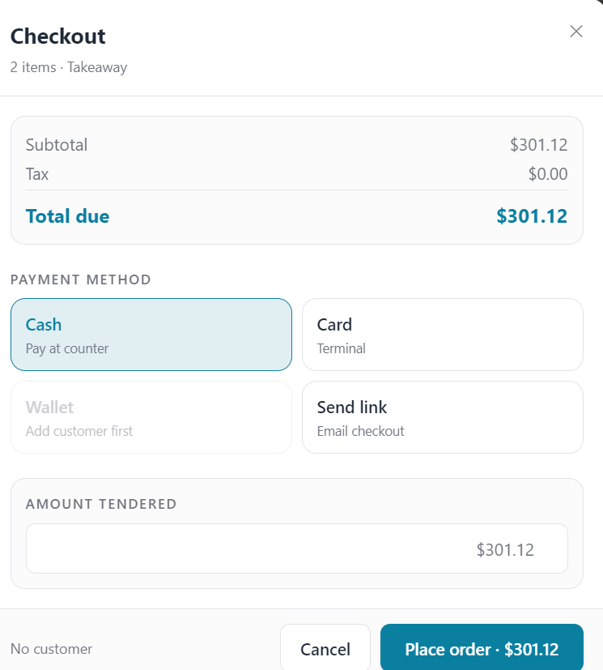

Sale Invoice — Requirements Specification

Overview
--------

This document captures the functional and acceptance requirements for the Filament "Create Invoice" page (SaleInvoices). It is written so a developer or QA engineer can reproduce the page without reading the current implementation. The spec emphasizes POS/terminal constraints: low latency interactions, Livewire server-side state with Alpine.js client-side responsiveness, numeric/currency correctness, and robust validation.

Files to inspect (implementation reference)

- app\Filament\Resources\SaleInvoices\\*

1. UI surface (fields and components)

---

1.1 Header & Meta

- [X]  Customer selection (optional) + inline Customer creation: name, mobile, email, adress. Persist to invoice.customer_id.
- [X]  barcode/search input
- [X]  POS terminal user/employee display (readonly).
- [X]  1.2 Cart / Invoice Items
  Each line must expose the following fields and labels:

- [X]  Price type (select): retail | wholesale — required. Default = retail. Changing price type updates unit price and min quantity constraints.
  - [X]  `issue: The minimum quantity constraint is applied however it is being  silently without any disclaimers or info so we need to display a line or something on tha cart item that is displayed when the price type is changed to wholesale that say the minimum allowed quantity for wholesale price is X quantity. show we show Min-allowed quantity message if qty < minAllowedForPriceType (display inline error)?`
  - [X]  `action: currently if the price type does not allow disc, it is shown in the disc modal, but we need to make it clear with zero click from the user, what do you suggest? red line idicator, or disable disc btn with tooltip or something else`
- [X]  Quantity (numeric, editable) — required. Shows UOM. For wholesale, quantity must meet minWholesaleQty (see validation).
  - [X]  `action: make sure validations happens on both front and backend`
- [X]  Unit price (currency, readonly)
  - [X]  `Q: if a disc hass been applied should we dispaly both orignal price and unit price after disc and display the orignal price as '~~123~~', which will add more usablity and clearty to the user . what do you think? will it be easy to implement?`
- [X]  Subtotal before discount (readonly) = unit price × qty (no per-item discounts applied yet).
  - [X]  `Q: do we need to dispaly it,how we are going to do it? if there is an applied disc will we display it price as '~~123~~'? will it be better? will it be easy to implement?`
- [X]  --------- unit disc modal ---------------
- [X]  breakdowns.
- [X]  Discount type (select): fixed | percentage (per unit).
- [X]  Unit discount value (numeric): interpret as currency when discount type=fixed, or percent when percentage. Show appropriate prefix/suffix (currency symbol / %). **Constrain based on maxUnitDiscount**.
  - [X]  `action: make sure validations happens on both front and backend`
- [X]  Total item discount (readonly) = unitDiscount × qty.
- [X]  `action: we need to display the 'line total after disc' in that unit disc modal breakdowns so the use has all related info in one place, what do you think about it, will it be easy to implement?`
- [X]  --------- unit disc modal ends-------------
- [X]  Line total (readonly) = subtotalBeforeDiscount − totalItemDiscount.
- [X]  `Q: Stock availability indicator (informational) is currently displayed in the products cards. if cart item qty > available what sould we do?  show warning and prevent checkout? disable qty increment? somting else?`
- [X]  Validation error messages should be localized and appear inline with the field, or as the use case or the desing require

1.3 Extra Items / Adjustments modal

- [X]  Add adjustment button opens a sub-form per adjustment:
  - [X]  Template (optional) — select a preset (for quick reuse).
  - [X]  Name (string) — required.
  - [X]  Action type (select): add | subtract
  - [X]  Amount (currency numeric) — required. If subtract, amount reduces invoice total.
  - [X]  Notes (optional).

1.4 Invoice-level discount modal

- [X]  Discount type (select): fixed | percentage — required; default: fixed.
- [X]  Discount amount (numeric): currency or percent depending on type. Show symbol or % accordingly.
- [X]  Max allowed invoice discount: computed from sum of items' minimum-allowed prices (see Calculations). Display helper text like: "Maximum allowed invoice-level discount: X".
- [X]  Final discount amount (readonly): for percentage, compute percent × sum(line totals). For fixed, equals entered fixed amount (unless capped by max allowed) just like the sale invoice creation page

1.5 Shipping modal

- [X]  Shipping destination selector / inline create button.
- [X]  Shipping cost (currency) — editable. Default provided by shipping dist.
- [X]  Shipping address — editable free text. Default provided by shipping dist

1.6 Summary (read-only computed area)

- Items subtotal (sum of all items' subtotalBeforeDiscount).
- Items discounts total (sum of all items' total item discounts).
- Extra adjustments total (sum of adds − subtracts).
- Invoice-level discount .
- Grand total discount (Invoice-level discount + Items discounts total).
- Shipping cost.
- Grand total: final amount due = Items subtotal − items discounts − invoice-level discount + extras total + shipping.

1.7 Actions

- [todo] Save as draft (persists invoice with status=draft).
- Finalize (checkout)/ Save & Print (persists as finalized, triggers print/receipt).
  - [todo] checkout modal
  - 
- [done] Cancel / Clear cart (confirmation required).
- [done] Add item (button), Remove item (trash icon on each line)

1. Validation rules

---

2.1 Numeric/scalar constraints (just like [SaleInvoiceForm](app\Filament\Resources\SaleInvoices\Schemas\SaleInvoiceForm.phphttps:/), [SaleInvoiceService](app\Services\SaleInvoiceService.phphttps:/))

- Currency representation: two decimal places by default; system config may alter (support minor units). Use decimal with precision: scale = 2
- Unit price: >= product.minAllowedPrice(priceType), where priceType ∈ {retail, wholesale} if minAllowedPrice is enabled.
- Wholesale quantity: qty >= product.minWholesaleQty when priceType=wholesale.
- Unit discount: >= 0 and <= unitPrice (if fixed), or 0..100 (if percent). Also cap by business-defined max unit discount per product.
- Invoice-level discount: if fixed, [0,maxInvoiceDiscountAmount]; if percent, [0,100].
- Shipping cost: >= 0.

2.2 Consistency and cross-field validation

- Line subtotal = qty × unitPrice — compute and verify.
- Total item discount equals unitDiscount × qty — compute and verify.
- if invoice-level discount (percentage) is used, apply only to base items compute percent against base items sum.
- Maximum invoice-level discount check ([SaleInvoiceForm](app\Filament\Resources\SaleInvoices\Schemas\SaleInvoiceForm.phphttps:/), [SaleInvoiceService](app\Services\SaleInvoiceService.phphttps:/))

2.3 Error messaging & flows

- Inline errors near fields; global error summary near Save button for blocking issues.
- Soft warnings (non-blocking) for stock shortages with explicit user confirmation required to finalize if policy requires.

3. Calculation & rounding rules

---

- All monetary calculations use Decimal arithmetic (no float) to the configured scale (default 2).
- Calculation order (must be strictly followed):
  1. Determine unit price for each item based on selected price type.
  2. SubtotalBeforeDiscount = unitPrice × qty.
  3. Per-item discounts (unit) applied → itemDiscountTotal = unitDiscount × qty.
  4. LineTotal = SubtotalBeforeDiscount − itemDiscountTotal.
  5. Sum line totals to compute base items total.
  6. Apply invoice-level discount (if percentage, compute percent × base items total; if fixed, subtract fixed amount but cap at allowed max).
  7. Add extras/adjustments (adds/subtracts).
  8. Add shipping cost.
  9. Final rounding to scale (bankers rounding or configurable; default: round half away from zero). Show final rounded total.

7. Permissions & roles:
   1. apply same as [SaleInvoiceForm](app\Filament\Resources\SaleInvoices\Schemas\SaleInvoiceForm.phphttps:/)
8. Livewire / Alpine / client-server interactions (performance & latency)

---

Design principles:

- Keep UI responsive: avoid full-page round trips. Use Livewire for server-side validation/state and Alpine.js for local fast interactions and client side validation.
- Local client computations: compute all need computations
- Validation: immediate client-side validation for every thing with authoritative server-side validation on submit/save.
- Edge cases & special flows

  - Negative totals: prevent finalizing if grand total < 0.
  - Max discount enforcement: must prevent discounts that would reduce any product below its minAllowedPrice.

10. Acceptance criteria & test cases

---

10.1 Happy path — basic sale

- Given a product with retail price 10.00, qty 2, no discounts, shipping 0, taxes 0
- When saved as finalized
- Then items subtotal = 20.00, grand total = 20.00, invoice.status = finalized, snapshot totals persisted

10.2 Per-item percentage discount

- Given unit price 100, qty 3, unit discount 10% (percentage)
- Then unit discount = 10.00, total item discount = 30.00, line total = 270.00

10.3 Invoice-level percentage discount limited by floor price

- Given two items whose minimum allowed totals sum to 100.00
- If user attempts a 60% invoice-level discount on current items subtotal 150.00
- Max allowed discount = 100.00 (cannot reduce below floor), system caps or rejects — acceptance rule: system must prevent discount that violates floor; present an explicit error explaining the max allowed.

10.4 Wholesale price validation

- Given product wholesale min qty = 10
- If price type=wholesale and qty < 10 → show inline error preventing finalize until corrected.

10.5 Stock warning

- If qty > available stock and stock policy = warning
- User can finalize after acknowledging warning; finalization logs the overdraw event.

10.6 Concurrency conflict

- Two users open invoice A. User 1 updates and finalizes. User 2 attempts to update afterwards -> system must show conflict message and allow user 2 to refresh or merge.

10.7 Permission enforcement

- Clerk tries to apply discount > clerk limit -> server rejects with error; UI shows message explaining required permission.

11. QA checklist & reproduction steps

---

Preconditions

- Seed database with products: retail and wholesale price entries, tax categories, shipping zones, customers (including tax-exempt), and at least one clerk and manager user.

Test flows

1. Create a new invoice: add item, set qty, confirm line totals.
2. Apply per-item fixed discount and percent discount; verify calculations.
3. Add an adjustment: add and subtract; verify adjustments included in summary.
4. Apply invoice-level percentage discount; verify cap enforcement when necessary.
5. Simulate low-network: disconnect and change quantities (client buffers), reconnect and ensure sync success or conflict surfaced.
6. Permission tests: attempt price override and large discounts as clerk vs manager.
7. Save as draft, re-open, modify, finalize — ensure snapshot totals match final totals.
8. Stock shortage path: add item more than available; verify warning and conditional finalize.

Acceptance checks

- All computed totals match expected decimal values using Decimal arithmetic
- Error messages are shown inline and localized (English + Arabic where applicable)
- Finalized invoices are immutable snapshots and create audit logs

12. Example data & sample sequences

---

Sample product JSON (for QA seeding):
{
"sku": "P-RED-M",
"name": "Medium Red AR",
"prices": {"retail": 150.00, "wholesale": 140.00},
"minAllowedPrice": {"retail": 130.00, "wholesale": 120.00},
"minWholesaleQty": 10,
"uom": "piece",
"tax_rate": 5.0,
"tax_included": false,
"stock": 8
}

Sequence: Add P-RED-M, price type wholesale, qty 12 (meets minWholesaleQty), unit price becomes 140 per line, subtotal 1680.00; apply per-unit fixed discount 5 -> item discount total 60 -> line total 1620.

13. Developer tasks (small, testable tickets)

---

- [DEV-1] Add server-side validations for minAllowedPrice, minWholesaleQty and invoice-level discount cap.
- [DEV-2] Implement client-side immediate computations for per-line subtotal and discount using Alpine; wire Livewire debounced sync (250ms) for authoritative save.
- [DEV-3] Add audit snapshot on finalize: persist computed totals and line details.
- [DEV-4] Implement optimistic concurrency / soft-lock with editor_id and expiry.
- [DEV-5] Add role-based discount/price override permissions and test coverage.
- [DEV-6] Implement tax calculation module configurable for per-line vs invoice-level tax and tax-inclusive/exclusive handling + tests.
- [DEV-7] QA seeds and automated integration tests for acceptance scenarios above.

14. Notes & open decisions

---

- Rounding mode (bankers vs half-up) — default set to ROUND_HALF_UP but must be confirmed.
- Should clerks be allowed to override unit price? If yes, must be server-side audited.
- Offline mode: the spec suggests buffering changes locally; concrete offline strategy and storage (IndexedDB/localStorage) must be designed.
- Return & credit note flows intentionally out of scope and require separate doc.

15. Localization & RTL

---

- All messages, labels, and number/date formatting must be localizable. Arabic (RTL) support must be verified: numeric separators and currency placement must follow locale.

16. Logging & audit

---

- Log all finalized invoices and actions affecting totals (discounts, price overrides) with user id, timestamp and reason (if applicable).

17. Traceability

---

- Map each acceptance test to a corresponding automated test in the test plan. Store test cases in repository under tests/Feature/Invoice*.

Appendix A: Quick reference formulas
------------------------------------

- SubtotalBeforeDiscount (line) = unitPrice × qty
- TotalItemDiscount = unitDiscount × qty
- LineTotal = SubtotalBeforeDiscount − TotalItemDiscount
- BaseItemsTotal = sum(LineTotal for all base items)
- InvoiceDiscountAmount = if fixed => min(enteredFixed, maxInvoiceDiscount) else => (percent / 100) × baseItemsTotal, capped by maxInvoiceDiscount
- GrandTotal = BaseItemsTotal − InvoiceDiscountAmount + AdjustmentsTotal + Shipping + Taxes

End of document
